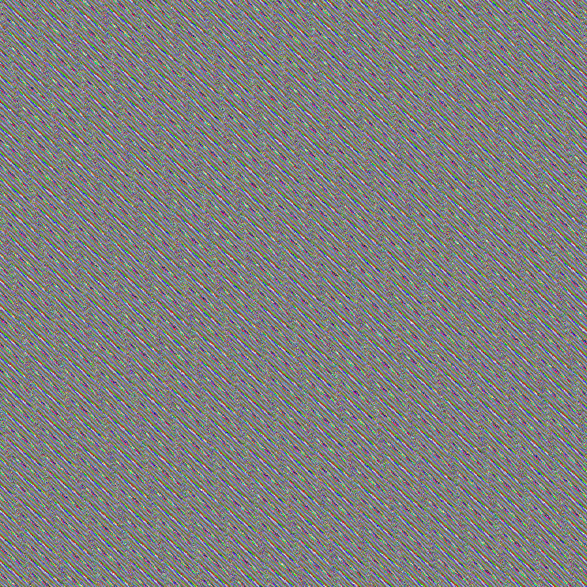
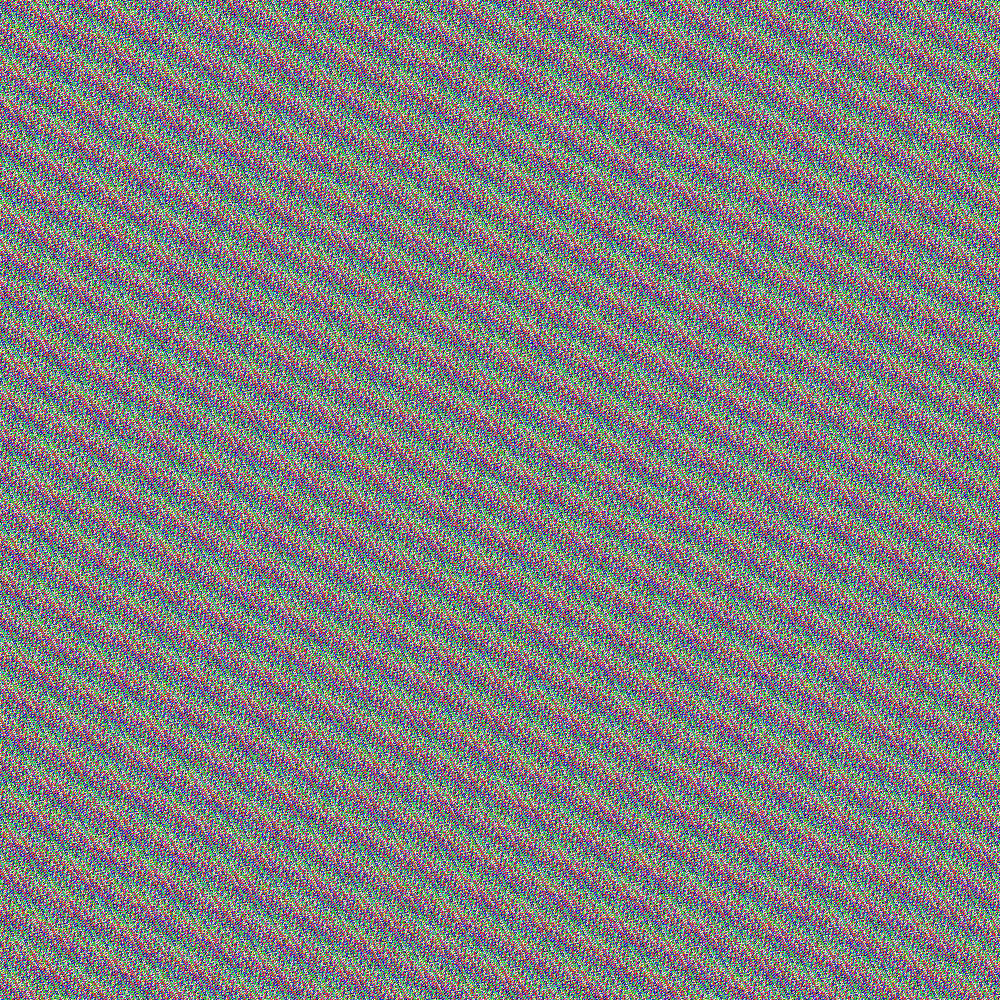
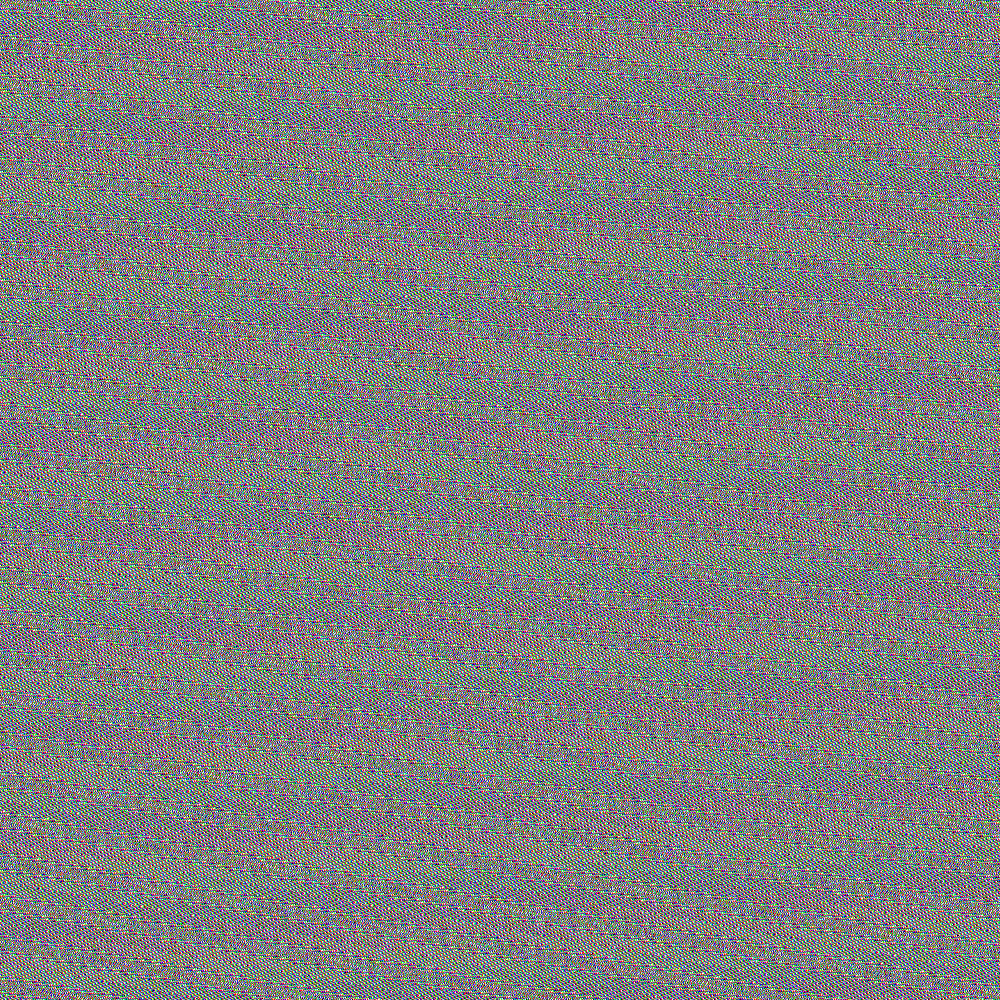
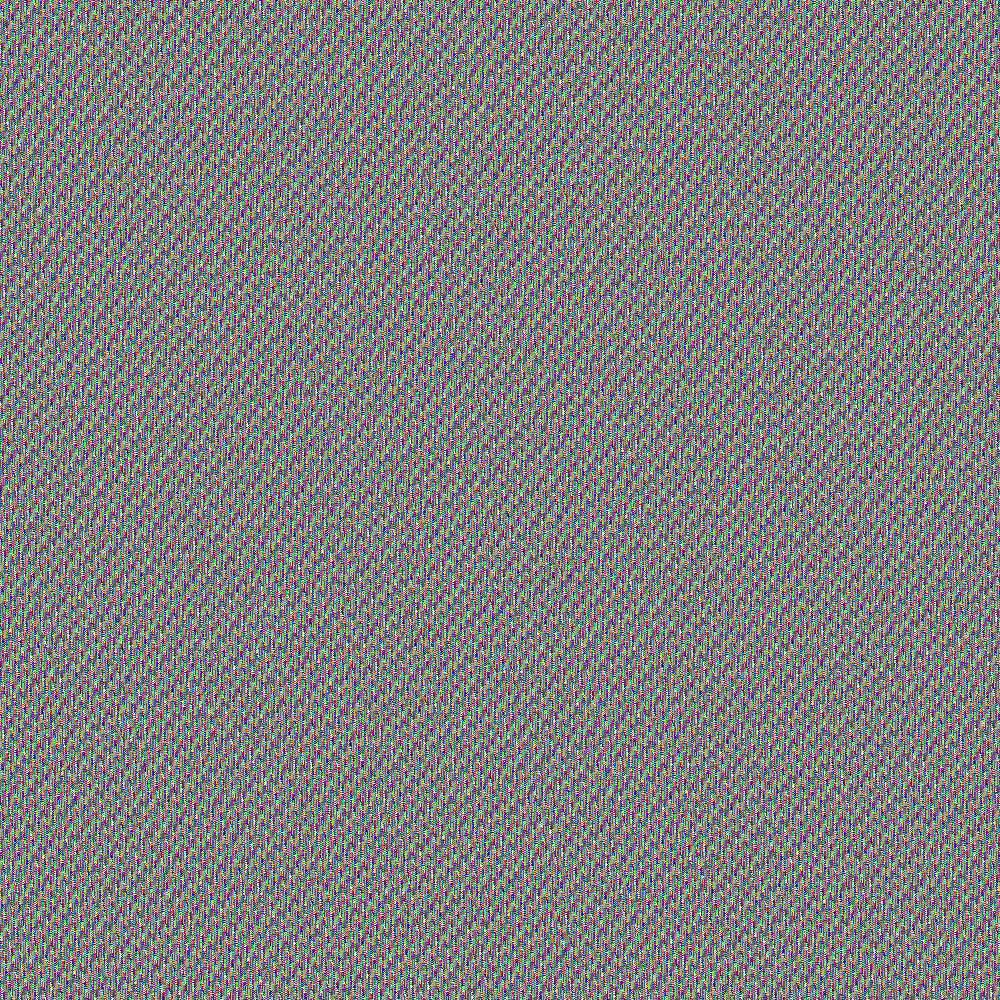

# Kgen

Generate noise with a twist 🤨.

This is a noise image generator that aims to create random patterns.

## Usage

`-x` - specifies the x dimension of the image

`-y` - specifies the y dimension of the image

`-fn` - the name (without the extension) the file should be saved as

> All of these are optional and will default to 100x100 and generated.png respectively

## Demo

| Examples `Kgen -x 100 -y 100`                                | Examples `Kgen -x 1000 -y 1000`                              |
|:------------------------------------------------------------:|:------------------------------------------------------------:|
|     |  |
|     |  |
|     |  |
|     |  |
